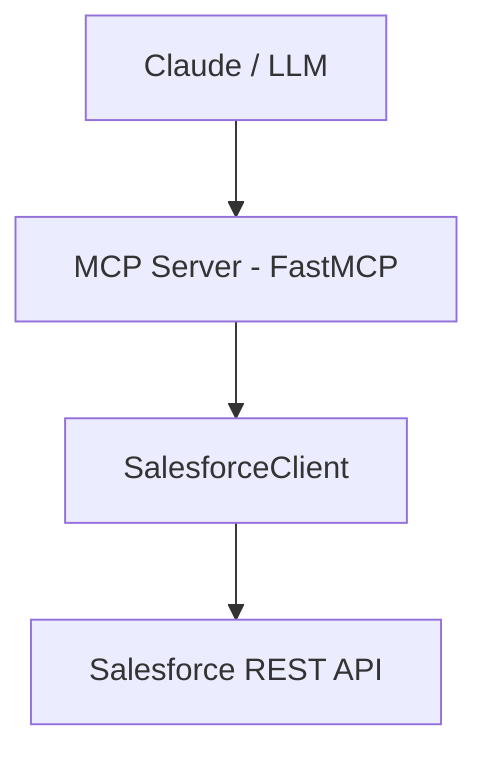

# MCP Salesforce Integration

A lightweight MCP (Model Context Protocol) server that exposes Salesforce Contacts and Appointments (Events) as callable tools for LLM agents.

This project implements:

* OAuth2 refresh-token authentication
* Automatic access token refresh
* Typed request models with Pydantic
* Clean Salesforce REST client abstraction
* MCP tool registration layer
* Full CRUD for:

  * Contacts (`Contact`)
  * Appointments (`Event`)

---

## Architecture



### Key Components

* `config.py` — Environment configuration via Pydantic
* `salesforce/client.py` — Auth + REST logic
* `salesforce/models.py` — Pydantic request models
* `tools/` — MCP tool wrappers
* `server.py` — MCP server entrypoint

---

## Features

### Contacts

* Create
* Get
* Update
* Delete
* List

### Appointments (Salesforce `Event`)

* Create
* Get
* Update
* Delete
* List

---

## ⚠️ MCP Execution Note

End-to-end tool invocation via Claude requires a Pro subscription. While this MCP server registers and connects successfully, tool execution through Claude could not be fully exercised without Pro access. Salesforce authentication and all CRUD operations were independently verified against the Salesforce REST API.

---

## Setup

### 1. Install dependencies

```bash
poetry install
```

---

### 2. Configure environment variables

Create a `.env` file in project root:

```
SALESFORCE_CLIENT_ID=...
SALESFORCE_CLIENT_SECRET=...
SALESFORCE_REFRESH_TOKEN=...
SALESFORCE_INSTANCE_URL=https://your-instance.salesforce.com
SALESFORCE_API_VERSION=v60.0
```

---

## Running the MCP Server

```bash
poetry run python -m mcp_salesforce.server
```

---

## Connecting to Claude Code

Register your server:

```bash
claude mcp add salesforce "poetry run python -m mcp_salesforce.server"
```

Verify:

```bash
claude mcp list
```

Start Claude:

```bash
claude
```

Example prompt:

> Use salesforce_list_contacts with limit 3

---

## Authentication Strategy

* Stores long-lived `refresh_token` in `.env`
* Access token generated via `/services/oauth2/token`
* On `INVALID_SESSION_ID`:

  * Refresh token
  * Retry request once
* Stateless beyond in-memory access token

No manual re-authentication required once refresh token is configured.

---

## Example Tool Usage

Create Contact:

```json
{
  "FirstName": "John",
  "LastName": "Doe",
  "Phone": "555-123-4567",
  "Email": "john@example.com"
}
```

Create Appointment:

```json
{
  "Subject": "Appointment",
  "StartDateTime": "2026-02-20T18:00:00.000+0000",
  "EndDateTime": "2026-02-20T18:30:00.000+0000",
  "WhoId": "003XXXXXXXXXXXX"
}
```

---

## Design & Trade-offs

See [`DESIGN_DECISIONS.md`](./DESIGN_DECISIONS.md) for architectural reasoning and trade-offs.

---

## Future Improvements

* Return typed response models instead of raw dicts
* Structured error model for Salesforce API errors
* Logging + observability
* Pagination handling
* Async version of client
